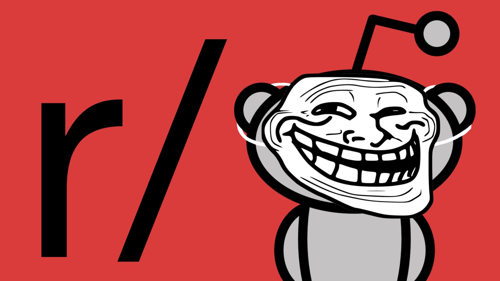
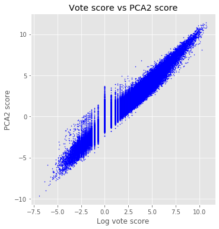
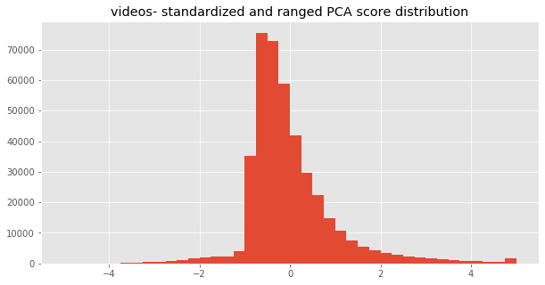
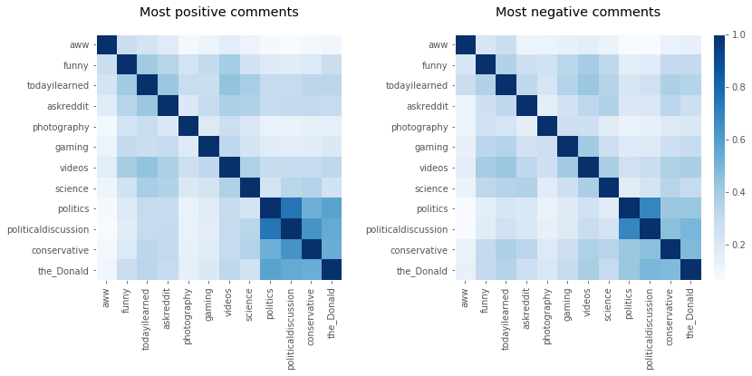
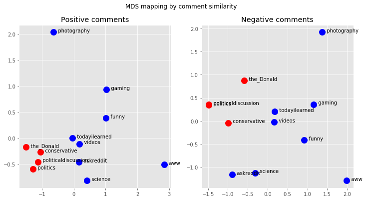
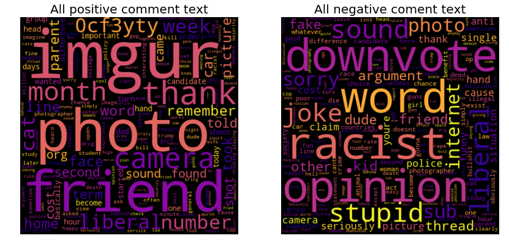
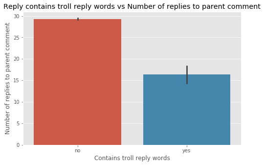
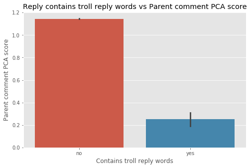

# Capstone Project 1:
# A Reddit troll rapid detection and warning tool

  

Table of contents:
- [The problem](#problem)
- [Methods](#methods)
- [Classifier Models](#classifier-models)

### Problem
Reddit allows anyone to participate in discussions in over a million subreddit forums. While Reddit’s format and rules give great freedom to communicate, they also allow participation by trolls and other bad actors who aim to disrupt online communities by posting argumentative, offensive or threatening comments. It‘s possible to identify some of these disruptive posters by their comment histories, but many trolls frequently create new accounts, which makes them hard to track.

This is a particularly difficult problem for Reddit moderators, who are responsible for ensuring that posts and comments meet community guidelines, and that the communities they manage remain positive and not toxic. In very large subreddit communities with political/ideological focus (for example r/politics), keeping track of trolls can be very difficult. I will develop an automated “troll early detection” tool for forum moderators that can monitor comments and report suspicious users before they can threadjack and disrupt otherwise civil discussions. For rapid detection, the tool will rely on comment text rather than posting history and votes, which can fluctuate initially. The troll early detection tool will be useful to moderators as an early warning that a threadjacking might be about to occur, so that they can assess and respond quickly if required.

### Methods
- **Data acquisition:** Using PRAW (Python Reddit API Wrapper) I downloaded a large sample of comments from a selection of subreddits with political or other topic focus, such as r/politics, r/republicans, r/democrats, and r/games, r/todayilearned and r/pics, where trolls often post. Each comment represents one text sample, with additional metadata such as: username, subreddit name, vote value and controversial flag state. 

  - Jupyter notebook: [Collecting Reddit comment data using PRAW](reddit_collect_comments_v1.ipynb)

- **Generating the Troll Label:** In order to train models to detect troll comments, the comment samples used in training must be labelled as "troll" or "not-troll". However, the downloaded comment data has no "troll" label, so I had to generate that label myself. Comment vote score is the closest measure to a troll indicator: comments that are offensive or disagreable to the forum community will usually be heavily downvoted, resulting in a very negative score. So I used vote score as a guide to creating a label that indicated comment toxcicity, or a troll user.
  
  - **Creating a toxicity score:**  I created a continuous variable "toxicity score" based on PCA analysis of comment features. This score was normalized and ranged to values between -5 (very toxic) and +5 (highly approved) so that scores between subreddits were comparable (subs vary in voting rates). Then, I selected a toxicity score threshold, below which a comment would be deemed "toxic", and above which it would be "not toxic". A threshold of -1 was selected, which ensured that roughly 2-5% of comments for a given sub would be labelled "toxic".

  - **PCA analysis methods:** Using the vote score as a guide, I correlated other comment metadata and selected the feature(s) that had strong correlations with vote score to include in a PCA analysis with two PCA dimensions. In my analysis (see Figures 1-3), the only other feature that correlated consistently with vote score was "number of replies to the comment". Two other features, "days since comment was made" and "overall user comment karma" were correlated, but the correlation varied greatly between subs and so these were excluded. PCA dimension 2 showed a positive regression with vote score and was chosen to use as the "toxicity score". This score was then normalized and ranged to values between -5 and +5. 

| Figure 1: feature correlations | Figure 2: Vote score vs PCA2 score | Figure 3: PCA-based score distribution |
| -- | -- | -- | 
|  |  |   |

  - Jupyter notebook: [Analysis of the PCA based toxicity scores.](reddit_analyze_PCA_score_v1.ipynb) 
  - Jupyter notebook: [Generating the toxicity score for every comment sample.](reddit_generate_PCA_score_v2.ipynb) 
  - Jupyter notebook: [Example comments from r/politics.](reddit_PCA_score_analysis.ipynb)
  - Jupyter notebook: [Generate Table 1 in markdown format.](reddit_generate_sub_data_stats.ipynb)

**Table 1: Sample counts for each subreddit dataset, including number of toxic vs. non-toxic labels.** For this project, a comment was labelled "toxic" if it had a toxicity score less than -1. Note that the political subreddits have a higher number of comments deemed toxic. This seems to be due to higher rates of downvoting in political subreddits.

| sub name | # samples | # not troll | # troll |
| -- | -- | -- | -- |
| aww | 217357 | 207315 | 10042 (4.6%) |
| funny | 255418 | 246812 | 8606 (3.4%) |
| todayilearned | 254686 | 237171 | 17515 (6.9%) |
| askreddit | 198972 | 194922 | 4050 (2.0%) |
| photography | 143707 | 137644 | 6063 (4.2%) |
| gaming | 389944 | 378513 | 11431 (2.9%) |
| videos | 413753 | 397537 | 16216 (3.9%) |
| science | 152385 | 147346 | 5039 (3.3%) |
| politics | 361384 | 340759 | 20625 (5.7%) |
| politicaldiscussion | 350382 | 306212 | 44170 (12.6%) |
| conservative | 124300 | 108493 | 15807 (12.7%) |
| the_Donald | 389035 | 354221 | 34814 (8.9%) |

- **Are troll comments the same across subreddits?** It would be ideal if a single model could be used to detect toxic comments in any subreddit. Alternatively, it might be the case that each subreddit has it's own vocabulary and responds differently to comments - it's possible that a highly rated comment in one sub is considered toxic in another. What I found was that each subreddit does indeed have its own vocabulary ofterms used, and that subs with similar topics are more similar. This suggests that a single model trained on all sub data will likely perform poorly compared to individual classifier models trained only on comments from a particular sub.

| Figure 4: Cosine similarity confusion matrix comparing all subs | Figure 5: MDS mapping based on the similarity matrix |
| -- | -- | 
|  |  |

- **What words are common to positive comments and are they different from negative comments?** For this analysis, I combined all positive comments (highly positive toxicity score) and all negative comments (very negative toxicity scores) and looked at the wordclouds for each.

| Figure 6: Wordclouds of positive comments and negative comments across subreddits  |
| -- |  
| |

  - Jupyter notebook: [Analysis of troll/toxic comments within vs between subs.](reddit_intersub_analysis_data_story.ipynb)

  - **Does a low PCA score predict actual troll comments?** Reddit provides no definitive label of "toxic" vs "non-toxic" comments. As a substitute, I have made a logical assumption that comments that are heavily downvoted are more likely to be toxic - "troll comments". I tested this assumption by examining whether replies to low vote score comments are more likely to contain the word "troll" - that is, other users are calling out the toxic commenter as a troll. If so, then that would indicate that a low vote score (and therefore a low PCA-based toxicity score) is associated with toxicity. The results of this analysis show that vote score, number of replies, and PCA toxicity score have significantly lower values when at least one reply contains the word "troll", verifying that they are good predictors of comment toxicity. An additional comment feature, "user karma", a measure of a user's overall vote score, was also associated with low values. User karma did not contribute to the PCA-based toxicity score, but was used as a feature for training the classifier models. 
  
  - Jupyter notebook: ["troll reply" analysis of toxicity score](reddit_reply_to_troll_analysis_v9.ipynb)

 | Figure 6a: Vote scores when replies contain the word "troll" | Figure 6b: Number of replies when replies contain the word "troll" | Figure 6c: User Karma when replies contain the word "troll" | Figure 6d: PCA-based toxicity score level when replies contain the word "troll" |
| -- | -- | -- | -- | 
|  |  |  |  |

  - #### Classifier models: 
    - I chose several models to evaluate based on their common use in NLP tasks. 
    - Model evaluation procedures:
      - Feature data used in training and testing varied from model to model, but included: comment metadata, vectorized comment text and Doc2Vec embedding vectors. 
        - Jupyter notebook: [Model feature data file creation.](reddit_comment_create_model_features_v1.ipynb)
      - Each model model was separately trained and tested with feature data from two different subs ('politics' and 'videos'). Testing two datasets was necessary because preliminary analyses found that political and non-political subs appear to have different downvoting behavior. I wanted to ensure that the classifier model would function equally well for both types of sub.
      - Hyperparameters were optimized using the hyperopt package
      - For each model type, optimized models were evaluated using k-fold cross validation for each subreddit in the dataset.
      - Metric statistics were reported for all models.
    - Models used:
      - The simplest model was Logistic Regression so it will be my baseline. 
      - Multinomial Naive Bayes
      - Random Forest
      - XGBoost
      - Recurrent Neural Network. 

    - Jupyter notebooks: 
      - [Multinomial Naive Bayes hyperparameter tuning](reddit_toxic_comment_detection_model_MNB_hyperopt_v1.ipynb)
      - [Multinomial Naive Bayes cross-validation](reddit_toxic_comment_detection_model_MNB_validation_v1.ipynb)

