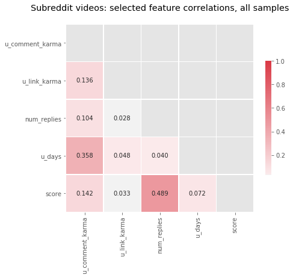
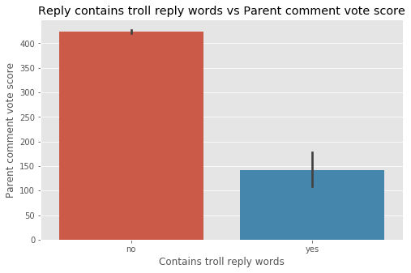
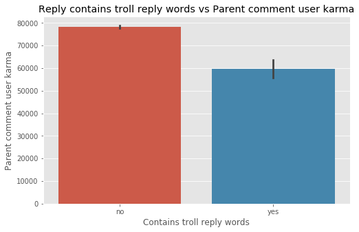
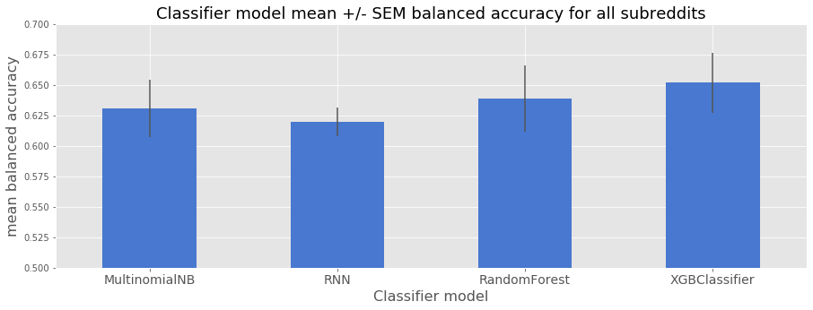
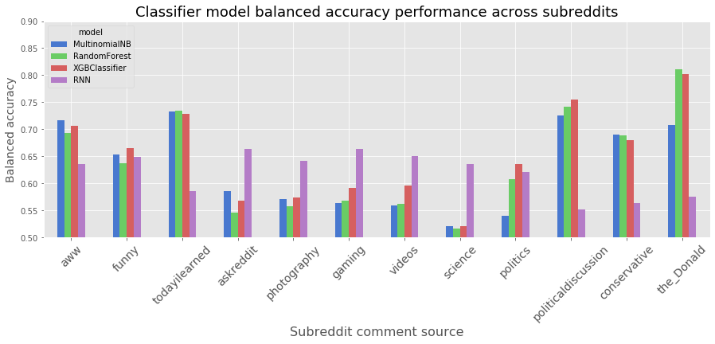
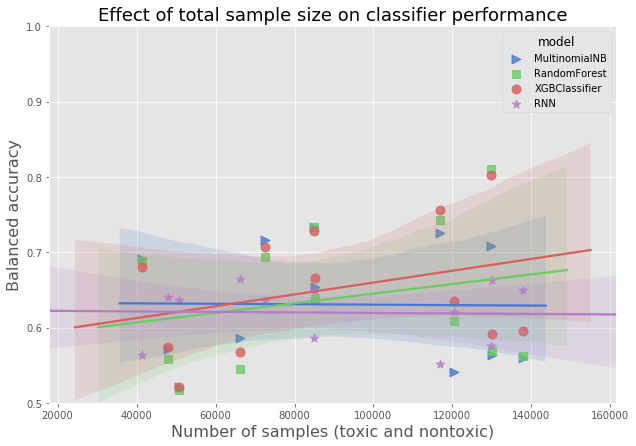
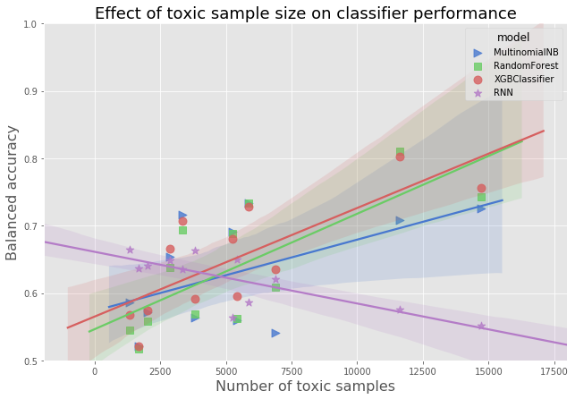
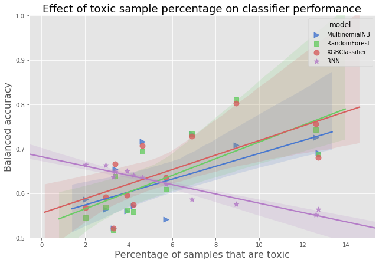

# Capstone Project 1:
# A Reddit troll rapid detection and warning tool

  

Table of contents:
- [The problem](#problem)
- [Methods](#methods)
- [Classifier Models](#classifier-models)
- [Results](#results)
- [Conclusions](#conclusions)
- [References](#references)
- [List of all notebooks](#all-notebooks)

## TLDR

The goal of this project was to build and test a toxic "troll" comment detector for subreddits on reddit, using NLP methods. I collected comments from 12 subreddits (subs) and labelled each comment as toxic or nontoxic based on comment metadata such as vote score. I tested performance of four classifier models trained with data from each sub: Multinomial Naive Bayes, Random Forest, XGBoost and a Recurrent Neural Network (RNN). I found that none of the classifiers performed particularly well (balanced accuracy metric, overall best: XGBoost at 65%, worst: RNN at 62%). Models differed in performance variance across sub datasets (highest balanced accuracy SEM: Random Forest at +/-3%, lowest: RNN at 1.5%), and differed in which subreddits they performed better or worse at. Taken together, I conclude that 1) further work needs to be done on model feature engineering and selection, and 2) while the RNN classifier performed lower than the other classifiers, it had the lowest performance variance across subreddits and was therefore more desireable. In the future I would recommend further improving the RNN model, using additional context and features. 

## Problem
Reddit allows anyone to participate in discussions in over a million subreddit forums. While Reddit’s format and rules give great freedom to communicate, they also allow participation by trolls and other bad actors who aim to disrupt online communities by posting argumentative, offensive or threatening comments. It‘s possible to identify some of these disruptive posters by their comment histories, but many trolls frequently create new accounts, which makes them hard to track.

This is a particularly difficult problem for Reddit moderators, who are responsible for ensuring that posts and comments meet community guidelines, and that the communities they manage remain positive and not toxic. In very large subreddit communities with political/ideological focus (for example r/politics), keeping track of trolls can be very difficult. I will develop an automated “troll early detection” tool for forum moderators that can monitor comments and report suspicious users before they can threadjack and disrupt otherwise civil discussions. For rapid detection, the tool will rely on comment text rather than posting history and votes, which can fluctuate initially. The troll early detection tool will be useful to moderators as an early warning that a threadjacking might be about to occur, so that they can assess and respond quickly if required.

## Methods
### **Data acquisition:** 

Using PRAW (Python Reddit API Wrapper) I downloaded a large sample of comments from a selection of subreddits with political or other topic focus, such as r/politics, r/republicans, r/democrats, and r/games, r/todayilearned and r/pics, where trolls often post. Each comment represents one text sample, with additional metadata such as: username, subreddit name, vote value and controversial flag state. 

| Jupyter notebook |
| -- |
| [Collecting Reddit comment data using PRAW](http://nbviewer.jupyter.org/github/johnmburt/springboard/blob/master/capstone_1/reddit_collect_comments_v1.ipynb) |

### **Generating the Troll Label:** 

In order to train models to detect troll comments, the comment samples used in training must be labelled as "troll" or "not-troll". However, the downloaded comment data has no "troll" label, so I had to generate that label myself. Comment vote score is the closest measure to a troll indicator: comments that are offensive or disagreable to the forum community will usually be heavily downvoted, resulting in a very negative score. So I used vote score as a guide to creating a label that indicated comment toxcicity, or a troll user.
  
 ### **Creating a toxicity score:**  
 
I created a continuous variable "toxicity score" based on PCA analysis of comment features. This score was normalized and ranged to values between -5 (very toxic) and +5 (highly approved) so that scores between subreddits were comparable (subs vary in voting rates). Then, I selected a toxicity score threshold, below which a comment would be deemed "toxic", and above which it would be "not toxic". A threshold of -1 was selected, which ensured that roughly 2-5% of comments for a given sub would be labelled "toxic".

### **PCA analysis methods:** 

Using the vote score as a guide, I correlated other comment metadata and selected the feature(s) that had strong correlations with vote score to include in a PCA analysis with two PCA dimensions. In my analysis (Figures 1-3), the only other feature that correlated consistently with vote score was "number of replies to the comment". Two other features, "days since comment was made" and "overall user comment karma" were correlated, but the correlation varied greatly between subs and so these were excluded. PCA dimension 2 showed a positive regression with vote score and was chosen to use as the "toxicity score". This score was then normalized and ranged to values between -5 and +5. 

| Figure 1: feature correlations | Figure 2: Vote score vs PCA2 score | Figure 3: PCA-based score distribution |
| -- | -- | -- | 
|  |  |   |

| Jupyter notebook |
| -- |
| [Analysis of the PCA based toxicity scores.](http://nbviewer.jupyter.org/github/johnmburt/springboard/blob/master/capstone_1/reddit_analyze_PCA_score_v1.ipynb) |
| [Generating the toxicity score for every comment sample.](http://nbviewer.jupyter.org/github/johnmburt/springboard/blob/master/capstone_1/reddit_generate_PCA_score_v2.ipynb) |
| [Example comments from r/politics.](http://nbviewer.jupyter.org/github/johnmburt/springboard/blob/master/capstone_1/reddit_PCA_score_analysis.ipynb) |
| [Generate Table 1 in markdown format.](http://nbviewer.jupyter.org/github/johnmburt/springboard/blob/master/capstone_1/reddit_generate_sub_data_stats.ipynb) |

**Table 1: Sample counts for each subreddit dataset, including number of toxic vs. non-toxic labels.** For this project, a comment was labelled "toxic" if it had a toxicity score less than -1. Note that the political subreddits have a higher number of comments deemed toxic. This seems to be due to higher rates of downvoting in political subreddits.

| sub name | # samples | # not troll | # troll |
| -- | -- | -- | -- |
| aww | 217357 | 207315 | 10042 (4.6%) |
| funny | 255418 | 246812 | 8606 (3.4%) |
| todayilearned | 254686 | 237171 | 17515 (6.9%) |
| askreddit | 198972 | 194922 | 4050 (2.0%) |
| photography | 143707 | 137644 | 6063 (4.2%) |
| gaming | 389944 | 378513 | 11431 (2.9%) |
| videos | 413753 | 397537 | 16216 (3.9%) |
| science | 152385 | 147346 | 5039 (3.3%) |
| politics | 361384 | 340759 | 20625 (5.7%) |
| politicaldiscussion | 350382 | 306212 | 44170 (12.6%) |
| conservative | 124300 | 108493 | 15807 (12.7%) |
| the_Donald | 389035 | 354221 | 34814 (8.9%) |

### **Are troll comments the same across subreddits?** 

It would be ideal if a single model could be used to detect toxic comments in any subreddit. Alternatively, it might be the case that each subreddit has it's own vocabulary and responds differently to comments - it's possible that a highly rated comment in one sub is considered toxic in another. What I found was that each subreddit does indeed have its own vocabulary ofterms used, and that subs with similar topics are more similar. This suggests that a single model trained on all sub data will likely perform poorly compared to individual classifier models trained only on comments from a particular sub.

#### Word similarity of comments between subs

How similar are comments made between the different subs? Are there different trends in similarity among positive vs. negative comments? Is the language used in political subs more similar than with other non-political subs?

For this analysis, I minimally pre-processed the comment text, count-vectorized, and used the cosine similarity measure on the vectors to assess relative similarity.

A plot of the similarity matrices shows some interesting patterns (Figure 4). First, the positive and negative comments were fairly similar in terms of which subs were more or less similar. Political subs (the lower-rightmost 4 in the matrix) were more similar to each other, while non-political subs were generally less similar to any others.

| Figure 4: Cosine similarity confusion matrix comparing all subs |
| -- |
|  |

#### MDS mapping the subreddit comment similarities (Figure 5) reveals several interesting trends:

- The political subs are clustered closely together, meaning the comments used similar language. Subs 'politics' and 'politicaldiscussion' are very close or overlapping. This suggests that the topics and commenting users may have high overlap.

- The non-political subs are much more spread out and show little or no clustering, suggesting that they each have a more unique vocabulary. Subs 'photography' and 'aww' seem to be especially distant from all other subs. In the case of 'photography', this makes sense, since the commonly used terms are technical and don't relate to any other subject. Aww's separation is interesting: it may be due to extensive use of image URLs, or the sub's users may have developed a unique lingo, as often happens within online communities. 

- Positively and negatively scored comments show very similar mappings (bearing in mind that MDS fits will rotate and flip mappings at random). 

| Figure 5: MDS mapping based on the similarity matrix |
| -- | 
|  |

### **What words are common to positive comments and are they different from negative comments?** 

For this analysis, I combined all positive comments (highly positive toxicity score) and all negative comments (very negative toxicity scores) and looked at the wordclouds for each (Figure 6).

It appears that there are words that make sense showing up in in positive comments (friend, thank, home, 0cf3yty), while some words in negative comments are appropriately "negative" or controversial as well (racist, downvote, stupid). Neutral words like 'opinion', 'word' and 'source' possibly show up in negative comments in phrases that challenge other users.

Image URL component "imgur" shows up frequently in the positive comments for both political and non-political subs. It may be that users tend to upvote image links more frequently regardless of the topic.

| Figure 6: Wordclouds of positive comments and negative comments across subreddits  |
| -- |  
| |

| Jupyter notebook |
| -- |
| [Analysis of troll/toxic comments within vs between subs.](http://nbviewer.jupyter.org/github/johnmburt/springboard/blob/master/capstone_1/reddit_intersub_analysis_data_story.ipynb) |

  - **Does a low PCA score predict actual troll comments?** Reddit provides no definitive label of "toxic" vs "non-toxic" comments. As a substitute, I have made a logical assumption that comments that are heavily downvoted are more likely to be toxic - "troll comments". I tested this assumption by examining whether replies to low vote score comments are more likely to contain the word "troll" - that is, other users are calling out the toxic commenter as a troll. If so, then that would indicate that a low vote score (and therefore a low PCA-based toxicity score) is associated with toxicity. The results of this analysis show that vote score (Figure 6a), number of replies (Figure 6b), and PCA toxicity score (Figure 6d) have significantly lower values when at least one reply contains the word "troll", verifying that they are good predictors of comment toxicity. An additional comment feature, "user karma", a measure of a user's overall vote score, was also associated with low values (Figure 6c). User karma did not contribute to the PCA-based toxicity score, but was used as a feature for training the classifier models. 
  
| Jupyter notebook |
| -- |
| ["troll reply" analysis of toxicity score](http://nbviewer.jupyter.org/github/johnmburt/springboard/blob/master/capstone_1/reddit_reply_to_troll_analysis_v9.ipynb) |

 | Figure 6a: Vote scores when replies contain the word "troll" | Figure 6b: Number of replies when replies contain the word "troll" | Figure 6c: User Karma when replies contain the word "troll" | Figure 6d: PCA-based toxicity score level when replies contain the word "troll" |
| -- | -- | -- | -- | 
|  |  |  |  |

  - #### Model feature engineering and model prep
  
    - Feature data used in training and testing varied from model to model, but included: comment metadata, vectorized comment text and Doc2Vec embedding vectors. These data were prepared from the base dataset, for each subreddit, and saved to two csv files: text features and Doc2Vec features.
    
    
    - Additionally, to simplify the following model notebook code, I moved several commonly used functions into a module to be imported by each notebook.

| Jupyter notebook |
| -- |
| [Model feature data file creation.](http://nbviewer.jupyter.org/github/johnmburt/springboard/blob/master/capstone_1/reddit_comment_create_model_features_v1.ipynb) |
| [Shared functions module](http://nbviewer.jupyter.org/github/johnmburt/springboard/blob/master/capstone_1/capstone1_helper.ipynb) |

  - #### Classifier models: 
    - I chose several models to evaluate based on their common use in NLP tasks. 
    - Model evaluation procedures:
      - Each model model was separately trained and tested with feature data from two different subs ('politics' and 'videos'). Testing two datasets was necessary because preliminary analyses found that political and non-political subs appear to have different downvoting behavior. I wanted to ensure that the classifier model would function equally well for both types of sub.
      - Hyperparameters were optimized using the hyperopt package
      - For each model type, optimized models were evaluated using k-fold cross validation for each subreddit in the dataset.
      - Metric statistics were reported for all models.
    - Models used:
      - Multinomial Naive Bayes
      - Random Forest
      - XGBoost
      - Recurrent Neural Network. 

      
| Model hyperparameter tuning notebooks | 
| --- |
| [Multinomial Naive Bayes](http://nbviewer.jupyter.org/github/johnmburt/springboard/blob/master/capstone_1/reddit_toxic_comment_detection_model_MNB_hyperopt_v1.ipynb) |
| [Random Forest](http://nbviewer.jupyter.org/github/johnmburt/springboard/blob/master/capstone_1/reddit_toxic_comment_detection_model_RandomForest_bal_hyperopt_v1.ipynb) |
| [XGBoost](http://nbviewer.jupyter.org/github/johnmburt/springboard/blob/master/capstone_1/reddit_toxic_comment_detection_model_XGBoost_hyperopt_v1.ipynb) |
| [Recurrent Neural Network](http://nbviewer.jupyter.org/github/johnmburt/springboard/blob/master/capstone_1/reddit_toxic_comment_detection_model_RNN_hyperopt_v2.ipynb) |
    

| Model cross-validation notebooks | 
| --- |
| [Multinomial Naive Bayes](http://nbviewer.jupyter.org/github/johnmburt/springboard/blob/master/capstone_1/reddit_toxic_comment_detection_model_MNB_validation_v2.ipynb) |
| [Random Forest](http://nbviewer.jupyter.org/github/johnmburt/springboard/blob/master/capstone_1/reddit_toxic_comment_detection_model_RandomForest_bal_validation_v1.ipynb) |
| [XGBoost](http://nbviewer.jupyter.org/github/johnmburt/springboard/blob/master/capstone_1/reddit_toxic_comment_detection_model_XGBoost_validation_v1.ipynb) |
| [Recurrent Neural Network](http://nbviewer.jupyter.org/github/johnmburt/springboard/blob/master/capstone_1/reddit_toxic_comment_detection_model_RNN_validation_v1.ipynb) |

### Results

I compared the performance of four classifier models across comment datasets from the 12 subreddits. The model performance data used for this analysis was logged during validation runs. For a metric, I chose balanced accuracy. Since this was a binary classification problem, a score of 50% was equivalent to a random prediction, and scores above that are better.

When evaluating model performance, I was looking at which models had the highest scores, but also how variable the models were: it wouldn't do for a model to perform very well with certain datasets, but very poorly with others.

#### Overall model performance, and intersub performance variability.

Looking at overall model performance for all subreddits (Figure 7), several results particularly stand out:

- None of the models performed very well. The model with the highest balanced accuracy was XGBoost (65%) , and lowest was RNN (62%). 

- XGBoost performed best, but performed the most variably across subreddits (SEM +/- 2.5%), while the worst performer, RNN, has the lowest variability across subreddits (SEM +/- 1.2%). The other two models also had higher variance than RNN. 

| Figure 7: Mean +/- SE model performance for all subreddits |
| -- | 
|  |

#### Comparing model performance across subreddits.

Looking at how models performed across all subreddits (Figure 8) revealed some interesting trends. 

- Each model performed differently with different subreddits. For example, the RNN performed much better than all other models on r/science, but was much poorer than the others on r/politicaldiscussion. The lowest model/sub score was 52% (RandomForest/science) and the highest was 81% (RandomForest/the_donald).

- The models MultinomialNB, RandomForest and XGBClassifier performed most similarly, while RNN often performed well when the others had poor balanced accuracy, and vice versa. That the first three models performed similarly is not surprising - they all used the same feature data, whereas the RNN had a very different data transformation process. 

| Figure 8: Model performance across subreddits |
| -- | 
|  |

#### Effect of total sample size on classifier performance

It's possible that some of the variation in classifier performance was due to the different sample sizes of each of the subreddits (max = gaming at 129982, min = conservative at 41434 samples total). I plotted balanced accuracy against total sample size for each subreddit and classifier type (Figure 9). If overall sample size predicts model performance, there should be a significant positive correlation, but that was not the case for any of the models.

| Figure 9: Effect of total number of training samples on model performance |
| -- | 
|  |

#### Effect of toxic sample size on classifier performance

Even if total training sample size had no impact, it could be that the number of toxic-labelled samples was important to model performance. I plotted balanced accuracy against number of toxic-labelled samples for each subreddit and classifier type (Figure 10). This produced interesting and puzzling results: three models, MultinomialNB, RandomForest and XGBClassifier, performed better when there were more toxic-labelled samples, but the RNN performed worse when there were more toxic-labelled samples.

| Figure 10: Effect of number of Toxic training samples on model performance |
| -- | 
|  |

#### Effect of toxic sample percentage on classifier performance

To further examine the effect of toxic-labelled sample size on model performance, I plotted balanced accuracy against the percentage of toxic-labelled comments in each subreddit dataset (Figure 11). This controls for overall sample size effect. I found an even stronger and similar effect: MultinomialNB, RandomForest and XGBClassifier performed better when there was a higher proportion of toxic-labelled samples, while the RNN performed worse. In fact, RNN shows a vey tight negative linear relationship with toxic-labelled sample proportion.

| Figure 11: Effect of percentage of toxic training samples on model performance |
| -- | 
|  |

| Jupyter notebook |
| --- |
| [Model evaluation and selection](http://nbviewer.jupyter.org/github/johnmburt/springboard/blob/master/capstone_1/reddit_toxic_comment_detection_model_selection_v1.ipynb) |

### Conclusions

### References

### All notebooks

| |
| -- |
| [Collecting Reddit comment data using PRAW](http://nbviewer.jupyter.org/github/johnmburt/springboard/blob/master/capstone_1/reddit_collect_comments_v1.ipynb) |
| [Analysis of the PCA based toxicity scores.](http://nbviewer.jupyter.org/github/johnmburt/springboard/blob/master/capstone_1/reddit_analyze_PCA_score_v1.ipynb) |
| [Generating the toxicity score for every comment sample.](http://nbviewer.jupyter.org/github/johnmburt/springboard/blob/master/capstone_1/reddit_generate_PCA_score_v2.ipynb) |
| [Example comments from r/politics.](http://nbviewer.jupyter.org/github/johnmburt/springboard/blob/master/capstone_1/reddit_PCA_score_analysis.ipynb) |
| [Generate Table 1 in markdown format.](http://nbviewer.jupyter.org/github/johnmburt/springboard/blob/master/capstone_1/reddit_generate_sub_data_stats.ipynb) |
| [Analysis of troll/toxic comments within vs between subs.](http://nbviewer.jupyter.org/github/johnmburt/springboard/blob/master/capstone_1/reddit_intersub_analysis_data_story.ipynb) |
| ["troll reply" analysis of toxicity score](http://nbviewer.jupyter.org/github/johnmburt/springboard/blob/master/capstone_1/reddit_reply_to_troll_analysis_v9.ipynb) |
| [Model feature data file creation.](http://nbviewer.jupyter.org/github/johnmburt/springboard/blob/master/capstone_1/reddit_comment_create_model_features_v1.ipynb) |
| [Shared functions module](http://nbviewer.jupyter.org/github/johnmburt/springboard/blob/master/capstone_1/capstone1_helper.ipynb) |
| [Hyperparameter tuning Multinomial Naive Bayes](http://nbviewer.jupyter.org/github/johnmburt/springboard/blob/master/capstone_1/reddit_toxic_comment_detection_model_MNB_hyperopt_v1.ipynb) |
| [Hyperparameter tuning Random Forest](http://nbviewer.jupyter.org/github/johnmburt/springboard/blob/master/capstone_1/reddit_toxic_comment_detection_model_RandomForest_bal_hyperopt_v1.ipynb) |
| [Hyperparameter tuning XGBoost](http://nbviewer.jupyter.org/github/johnmburt/springboard/blob/master/capstone_1/reddit_toxic_comment_detection_model_XGBoost_hyperopt_v1.ipynb) |
| [Hyperparameter tuning Recurrent Neural Network](http://nbviewer.jupyter.org/github/johnmburt/springboard/blob/master/capstone_1/reddit_toxic_comment_detection_model_RNN_hyperopt_v2.ipynb) |
| [Cross-validation Multinomial Naive Bayes](http://nbviewer.jupyter.org/github/johnmburt/springboard/blob/master/capstone_1/reddit_toxic_comment_detection_model_MNB_validation_v2.ipynb) |
| [Cross-validation Random Forest](http://nbviewer.jupyter.org/github/johnmburt/springboard/blob/master/capstone_1/reddit_toxic_comment_detection_model_RandomForest_bal_validation_v1.ipynb) |
| [Cross-validation XGBoost](http://nbviewer.jupyter.org/github/johnmburt/springboard/blob/master/capstone_1/reddit_toxic_comment_detection_model_XGBoost_validation_v1.ipynb) |
| [Cross-validation Recurrent Neural Network](http://nbviewer.jupyter.org/github/johnmburt/springboard/blob/master/capstone_1/reddit_toxic_comment_detection_model_RNN_validation_v1.ipynb) |
| [Model evaluation and selection](http://nbviewer.jupyter.org/github/johnmburt/springboard/blob/master/capstone_1/reddit_toxic_comment_detection_model_selection_v1.ipynb) |
